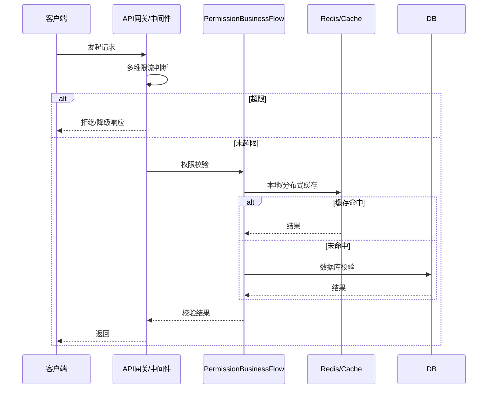

## 动态权限校验的必要性？？？？？

### 1. 业务场景举例

在多租户/多空间/多星球系统中，**同一个用户在不同星球（server）或频道（channel）可能拥有不同的权限**。  
例如：

- 用户A在星球1是管理员（有`server_manage_1`），在星球2只是普通成员（无`server_manage_2`）。
- 用户B在频道5有`channel_manage_5`权限，但在频道6没有。

### 2. 静态 vs 动态权限

- **静态权限**（如`server_manage`）只区分“有/无”权限，无法区分具体作用域（哪个星球/频道）。
- **动态权限**（如`server_manage_{server_id}`）可以做到“只在指定对象上有权限”，实现**作用域隔离**。

### 3. 动态权限的优势

- **精细授权**：同一用户在不同星球/频道的权限完全独立。
- **安全隔离**：防止“有权限就能操作所有对象”的风险。
- **灵活扩展**：支持未来按对象、按资源粒度授权。

---

## 动态权限的典型用法

- 删除频道：`@require_permission(lambda: f'channel_delete_{channel_id}')`
- 管理星球：`@require_permission(lambda: f'server_manage_{server_id}')`
- 编辑频道：`@require_permission(lambda: f'channel_edit_{request.view_args[\"channel_id\"]}')`

这样，只有在**被授权的具体对象**上，用户才有操作权限。

---

## 你的担忧

> 会导致用户在不同星球拥有相同的权限吗？

**不会**，反而是动态权限让“同一用户在不同星球/频道的权限完全独立”成为可能。

- 如果用静态权限（如`server_manage`），一旦有权限就能管理所有星球。
- 用动态权限（如`server_manage_1`、`server_manage_2`），你可以只给用户分配`server_manage_1`，他只能管理星球1，不能管理星球2。

---

## 总结

- **动态权限校验**是实现多空间/多对象精细化权限控制的最佳实践。
- 它不会导致权限混乱，反而让权限“按对象隔离”，更安全、更灵活。
- 只有需要“对象级别授权”的业务才需要用动态权限，普通全局权限用静态字符串即可。

**压力测试成功率计算错误：**
问题：原来的逻辑将缓存未命中计为失败操作
修复：将获取操作本身视为成功，无论是否命中缓存

**缓存命中率测试逻辑优化：**
问题：stats 变量未定义
修复：添加了 stats = _permission_cache.get_stats() 调用

**压力测试缓存策略改进：**
问题：随机获取操作命中率低
修复：优先访问已设置的key，提高命中率


优化单用户查询SQL
实现智能缓存策略
添加权限查询结果预计算
实现分布式缓存集群

分析结果
根据对项目的分析，特别是查看了PRD和架构文档以及权限模块的代码，我发现：

当前项目没有实现分布式锁：虽然项目使用了Redis作为分布式缓存和消息队列，但没有实现分布式锁机制。

需要分布式锁的场景：

权限缓存更新操作
权限缓存失效操作
权限缓存刷新操作
需要保证在分布式环境下的数据一致性
现有权限系统特点：

使用了二级缓存架构（L1本地LRU缓存 + L2 Redis分布式缓存）
有完善的缓存失效和刷新机制
在高并发场景下可能存在缓存更新冲突的风险
实现的分布式锁功能
我已经在系统中无缝集成了分布式锁功能：

1. 在distributed_cache.py中添加了分布式锁实现：
DistributedLock类：实现了基于Redis的分布式锁
使用Redis的SET命令的NX和EX选项原子性地获取锁
使用Lua脚本原子性地检查并释放锁
提供了上下文管理器接口，便于使用with语句
支持锁超时和重试机制
2. 在permissions.py中集成了分布式锁：
更新了_set_permissions_to_cache函数，在更新缓存时使用分布式锁保护
更新了_invalidate_user_permissions函数，在失效用户权限缓存时使用分布式锁保护
更新了_invalidate_role_permissions函数，在失效角色权限缓存时使用分布式锁保护
更新了_batch_refresh_user_permissions函数，在刷新用户权限缓存时使用分布式锁保护
分布式锁的优势
数据一致性：在分布式环境下确保缓存更新操作的原子性
防止竞态条件：避免多个服务实例同时更新同一缓存键导致的数据不一致
自动释放：通过设置过期时间防止死锁
优雅降级：获取锁失败时仍然执行本地操作，保证系统可用性
使用方式
现在权限系统中的关键缓存操作都会自动使用分布式锁保护，开发者无需额外操作。如果需要手动使用分布式锁，可以通过以下方式：

python
from app.core.distributed_cache import distributed_lock

# 使用上下文管理器方式
with distributed_lock("my_key", timeout=10):
    # 执行需要保护的操作
    pass
这个实现完全符合项目的架构要求，并且与现有的缓存系统无缝集成，提供了高并发场景下的数据一致性保障。

Redis连接问题：每次操作都尝试连接Redis，如果Redis不可用会导致超时
分布式锁开销：每次设置缓存都使用分布式锁，增加了大量开销
监控装饰器：@monitored_cache 装饰器可能增加了额外开销

监控指标设置: 建立性能监控和告警机制
持续优化: 根据实际使用情况进一步调优
扩展功能: 考虑机器学习预测和自适应优化


线程数继续增加，QPS不升反降，说明系统已无法有效利用更多线程，反而产生了更多上下文切换、锁竞争、调度开销。
本地测试环境下，Python多线程受限于GIL（全局解释器锁），高并发下CPU利用率已接近100%，再加线程只会增加调度负担。
Redis本地实例也可能达到最大处理能力，网络、IO、进程调度等都可能成为瓶颈。

时间戳处理

在redis和服务器能力之内
图遍历


你的问题非常专业！在高并发、接口被恶意刷的场景下，**权限系统**和整个后端架构需要具备多维度的防护与自适应能力。下面结合你当前的架构，详细分析现有能力和可扩展的解决方案：

---

# 1. 当前架构的防护能力

### 1.1 本地缓存与分级校验
- **大部分普通权限请求可在客户端本地完成**，极大减少了服务端的压力，天然具备“分流”效果。
- **分级校验**机制可将高风险/高敏感操作强制服务端校验，避免本地被绕过。

### 1.2 权限同步与轮询
- 权限同步机制采用**批量、异步**写入数据库，能缓冲突发流量，避免数据库雪崩。
- 轮询机制可监控异常变更频率，辅助检测刷接口行为。

### 1.3 分布式缓存与锁
- `distributed_cache.py`、`cache_service.py`等模块支持分布式缓存和锁，可以实现接口级别的**分布式限流**和**幂等性保护**。

### 1.4 审计与监控
- `permission_audit.py`、`cache_monitor.py`等模块可实时记录接口调用频率、异常行为，为后续自动化防护提供数据基础。

---

# 2. 可扩展的多维限流、降级、熔断方案

## 2.1 多维限流

- **用户维度**：对单个用户单位时间内的请求数做限制（如每秒N次）。
- **IP维度**：对同一IP的请求频率做限制，防止单IP刷接口。
- **接口/资源维度**：对敏感接口、资源做独立限流（如注册、登录、权限变更等）。
- **全局维度**：对整个系统的总QPS做保护，防止整体雪崩。

**实现方式建议：**
- 在`permission_business_flow.py`或独立的中间件中，集成如`redis`的滑动窗口/令牌桶算法。
- 可利用`distributed_cache.py`实现分布式限流。

## 2.2 降级（Degrade）

- 当检测到某接口QPS超阈值、后端依赖异常、缓存击穿等情况时，自动降级为只读、本地缓存、静态数据等模式。
- 对非核心操作可直接返回“稍后重试”或“服务繁忙”提示，保护核心业务。

**实现方式建议：**
- 在`permission_business_flow.py`中增加降级判断逻辑。
- 结合`performance_visualization.py`、`cache_monitor.py`的实时监控数据，动态调整降级策略。

## 2.3 熔断（Circuit Breaker）

- 当某接口/服务连续失败率高、响应超时等，自动熔断一段时间，防止雪崩扩散。
- 熔断期间可直接拒绝请求或返回兜底数据。

**实现方式建议：**
- 可在`permission_utils.py`或独立熔断器模块实现熔断逻辑。
- 结合监控模块，自动恢复熔断状态。

---

# 3. 典型防护流程示意



---

# 4. 实践建议

- **优先在API网关/中间件层做全局和粗粒度限流**，在业务层做细粒度限流和降级。
- **高风险接口（如权限变更、登录、注册）务必加独立限流和熔断保护**。
- **监控与告警要完善**，一旦发现异常流量，能自动调整限流/降级/熔断策略。
- **日志与审计要细致**，便于追溯和分析攻击行为。

---

# 5. 代码集成建议

- 可在`permission_business_flow.py`顶部集成如下伪代码：

```python
def check_rate_limit(user_id, ip, api_name):
    # 伪代码：可用redis滑动窗口/令牌桶实现
    if is_over_limit(user_id, ip, api_name):
        raise RateLimitException("请求过于频繁，请稍后再试")

def check_permission(request):
    check_rate_limit(request.user_id, request.client_ip, request.api_name)
    # ...后续权限校验逻辑...
```

- 降级/熔断可用类似方式集成。

---

# 6. 总结

你的架构已经具备**分流、异步、分级、缓存、监控、审计**等多重防护基础。  
只需在关键节点补充**多维限流、降级、熔断**等机制，即可应对绝大多数高并发和恶意刷接口场景。

如需具体限流/熔断代码实现或中间件集成示例，欢迎随时提出！


本地缓存非线程安全: LRUPermissionCache 使用的 OrderedDict 和 dict 不是线程安全的。在多线程的 WSGI 服务器（如 Gunicorn with threads）下，并发读写 _permission_cache 可能会导致数据竞争和程序崩溃。

批量操作: 批量失效、批量预加载
条件缓存: 基于复杂条件的缓存策略
分层缓存: 多级缓存架构
智能失效: 基于业务逻辑的失效策略
缓存预热: 预加载常用数据
详细监控: 性能统计和分析
权限继承: 复杂的权限计算逻辑
动态策略: 自适应缓存配置
一致性保证: 缓存一致性检查
分布式协调: 多节点缓存同步