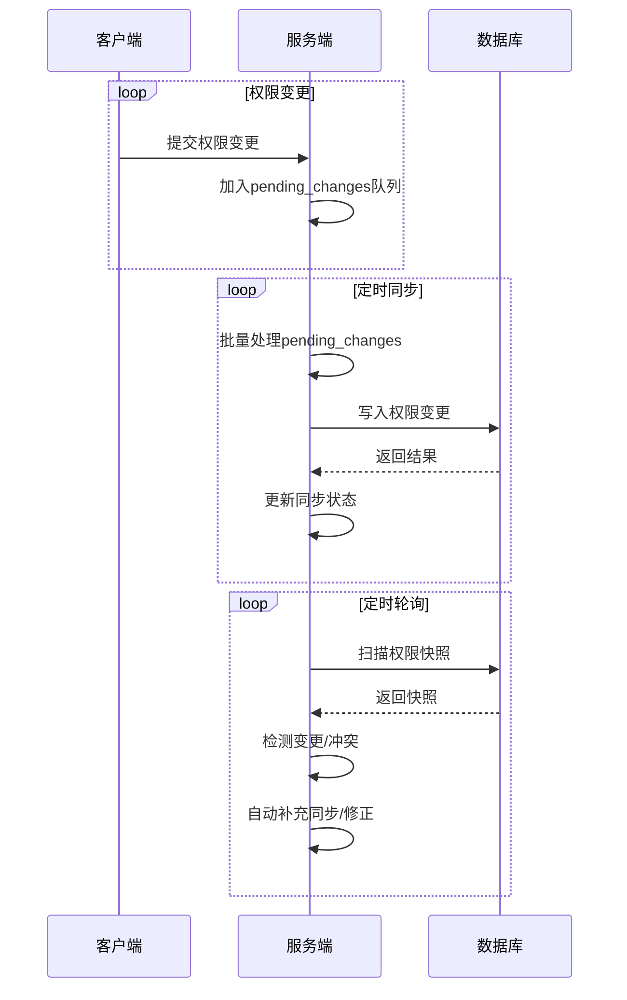

# 权限同步机制原理与流程

## 一、原理概述

权限同步机制的目标是：
- 当客户端（或用户）在本地修改了自身权限后，能够及时、可靠地将这些变更同步到服务器和数据库，保证服务端与客户端权限状态一致。
- 同时，服务器端也能通过轮询等方式及时发现和处理权限变更，避免数据不一致或延迟。

---

## 二、核心组成

1. **PermissionSyncManager（权限同步管理器）**
   - 负责收集、批量处理和同步所有待处理的权限变更。
   - 通过后台线程定时（如每30秒）将变更写入数据库。
   - 支持失败重试、同步状态统计、变更历史记录等。

2. **PermissionPoller（权限轮询器）**
   - 负责定期（如每10秒）扫描数据库中的权限状态，生成权限快照。
   - 检测权限变更（如客户端本地变更未及时同步），并自动补充同步。
   - 可检测权限冲突，辅助权限一致性校验。

3. **应用上下文管理**
   - 所有涉及数据库操作的后台线程都在Flask的`app.app_context()`下运行，保证ORM和数据库操作的合法性。

---

## 三、详细流程

### 1. 客户端权限变更的产生与收集

- 用户在客户端界面上更改了自己的某项权限（如“开通频道管理”）。
- 客户端会将这次变更（包括用户ID、权限名、变更类型、时间戳等）通过接口或本地缓存，推送到服务端。
- 服务端的`PermissionSyncManager`收到变更后，加入`pending_changes`队列，等待批量处理。

### 2. 权限同步线程的批量处理

- `PermissionSyncManager`后台线程每隔一段时间（如30秒）自动唤醒。
- 在`app.app_context()`下，批量取出待同步的变更，依次写入数据库（如授予/撤销某用户某权限）。
- 成功的变更会被标记为已同步，失败的会进入重试队列，并记录失败原因。
- 同步完成后，更新统计信息（如同步次数、成功/失败数、平均耗时等）。

### 3. 权限轮询与快照

- `PermissionPoller`后台线程每隔一段时间（如10秒）自动唤醒。
- 在`app.app_context()`下，扫描所有用户的权限，生成当前快照。
- 与上一次快照对比，发现有权限变更（如本地未同步的变更），则自动补充到同步队列，保证最终一致性。
- 也可检测权限冲突（如同一用户同时拥有互斥权限），并可自动修正。

### 4. 权限冲突检测与修正

- 轮询器支持自定义冲突规则（如“admin”和“user”不能同时拥有）。
- 检测到冲突后，可自动修正（如保留高优先级权限，撤销低优先级权限）。

### 5. 实时监控与统计

- 所有同步和轮询操作都支持实时监控（如当前待同步变更数、同步成功率、冲突数等）。
- 支持历史变更查询、同步性能分析等。

---

## 四、典型时序图

---

## 五、优点

- **高可靠性**：即使客户端未及时同步，轮询机制也能自动发现并补救。
- **高性能**：批量同步、异步处理，减少数据库压力。
- **一致性强**：多重检测，保证权限数据最终一致。
- **可扩展**：支持自定义冲突规则、同步策略、监控统计等。 